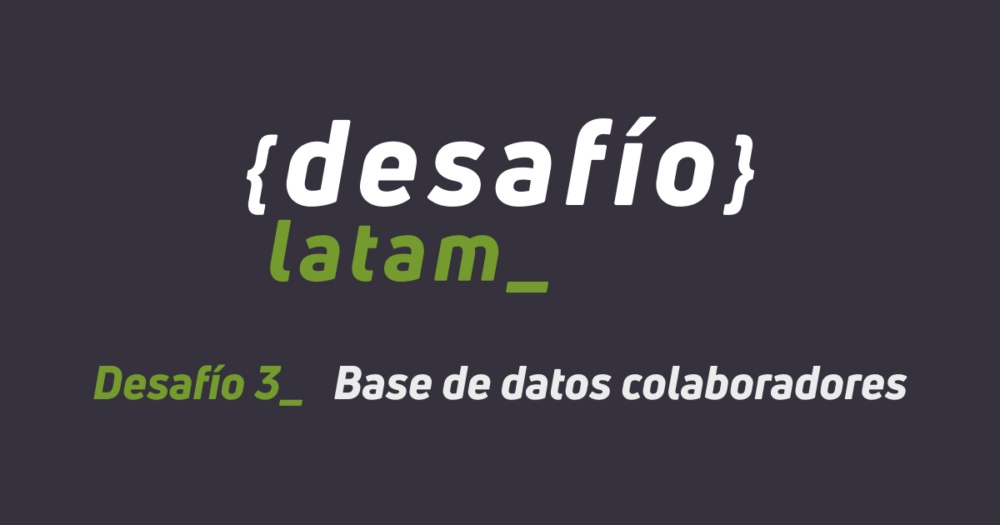

# Solución al Desafío "Base de datos colaboradores"

## Academia Desafío Latam | Bootcamp Fullstack con JavaScript - G41

### Trabajo colaborativo

Forkeé y envié pull requests a los repositorios de los siguientes compañeros:

- [Javier Figueroa](https://github.com/javiernfigueroa/Desafio-react-3)

Recibí y acepté las pull requests de los siguientes compañeros:
